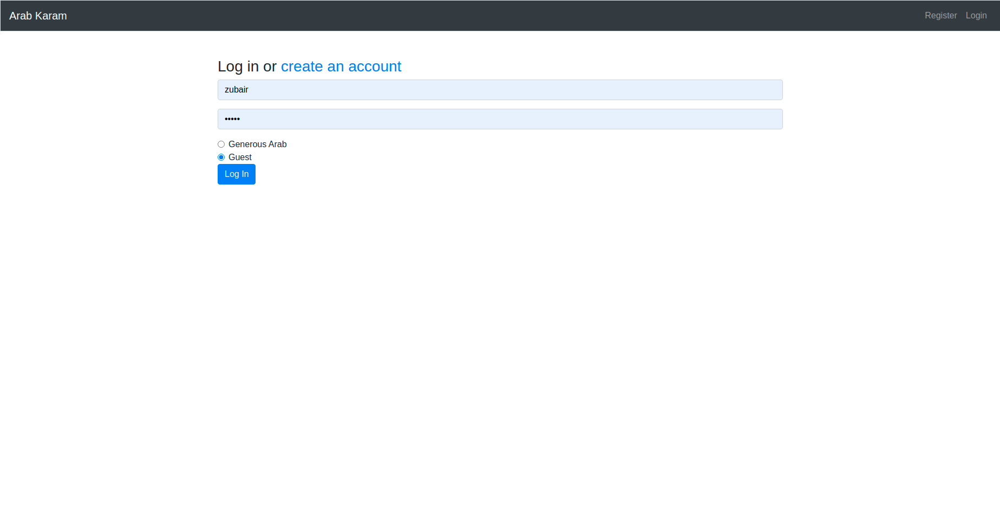

# Host Guest Review App (Python Flask)

# Home Page

# Login Page

# Guest View

# Review Page

# Host View

# Quickstart
1. Create a virtual env and activate it. 
2. Install flask by typing `pip install flask`.
3. To start the server, Please run `flask run --reload`.
